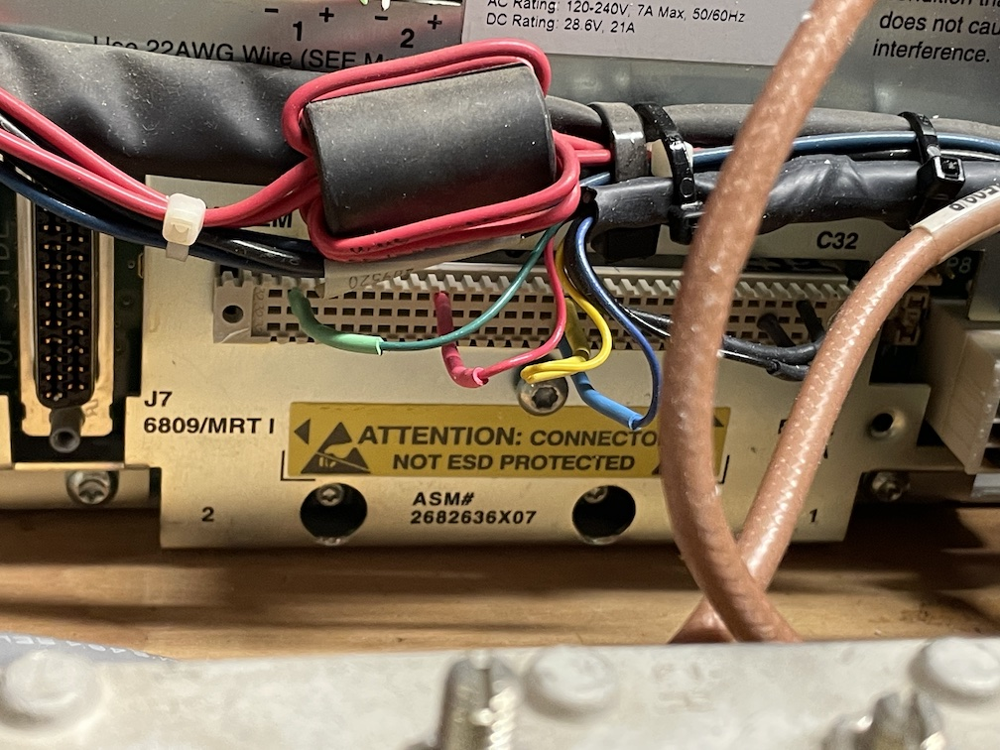

Motorola MTR2000
================

## References

* [Repeater Builder Index Page](https://www.repeater-builder.com/motorola/mtr2k/mtr-index.html)
* [Good Controller Interface Page](https://www.repeater-builder.com/motorola/mtr2k/mtr-interfacing/mtr2000-interfacing.html)

## Controller Interface Cable

Cable out of the back of the controller:

* Blue (A-17) Auxiliary Transmit Audio.
* Green (C-2) Receiver Un-Squelched.  TTL output active high.
* Red (C-10) External PTT.  TTL input active low.  
* Yellow (C-17) Discriminator Audio Output.  +2.5V DC bias measured.
* Shield (C-31) Ground. This appears to be the signal ground for TTL I/Os.
* Black (B-27) Ground.

The interface documentation linked above seems to imply that the shield and black wire ground are the same thing, but testing indicates that the TTL signals are referenced to pin A-19 (shield). The grounds are not the same.

Notes on photo below:

* The repeater has a 96 pin (3x32) Euro female connector on the back. The cable described above isn't attached using a formal connector, but instead is a set of pins plugged into the appropriate places on the Euro connector. The cable is tied to the chassis in a few places to provide strain relief.  This is a bit precarious, but it should be fine.   
* The rows on the Euro connector are, from top to bottom: C, B, A. The pins are numbered from left to right.
* Using the green wire on the left as an example, this is plugged into the top row, second column. Numbering: C-2.
* The connection farthest to the right is the shield.  Appears to be C-31, which is different from what Larry's handwritten notes showed (his notes had A-19)

