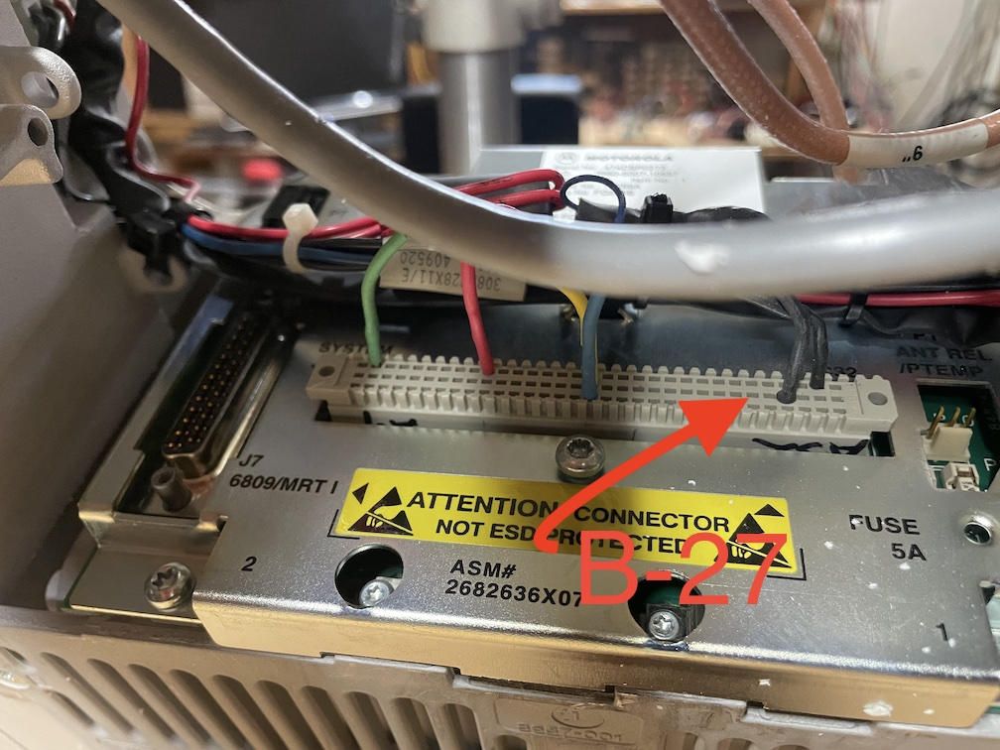
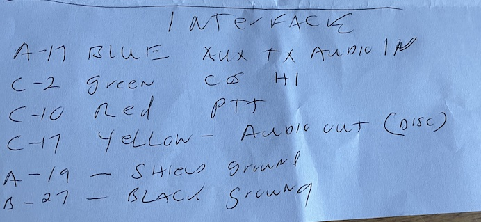
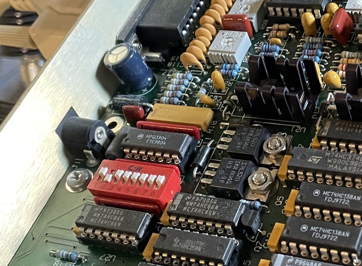

W1TKZ Motorola MTR2000
======================

As of March 15, 2025 we use the MTR2000 on the UHF side of the W1TKZ 
repeater system.

## References

* [Repeater Builder Index Page](https://www.repeater-builder.com/motorola/mtr2k/mtr-index.html)
* [Good Controller Interface Page](https://www.repeater-builder.com/motorola/mtr2k/mtr-interfacing/mtr2000-interfacing.html)

## Controller Interface Cable

Cable out of the back of the repeater:

| Color  | MTR2000 Pin | MTR2000 Purpose             | DB9F Pin |
|--------|-------------|-----------------------------|----------|
| Blue   | A-17        | Auxiliary Transmit Audio In |    2     |
| Green  | C-2         | Receiver Un-Squelched and PL detected (TTL output active high) | 6  | 
| Red    | C-10        | External PTT (active low)   |    3     |
| Yellow | C-17        | Discriminator Audio Out     |    5     |
| Shield | C-31        | Ground                      |    9     |
| Black  | B-29        | UNKNOWN                     |  None    |

NOTES:
* The MTR2000 asserts +5V on the green wire (DB9F pin 6) for COS.
* The red wire (DB9F pin 3) must be pulled to ground to activate the MTR2000 PTT.
* Audio pins 2 and 5 above have DC blocking capacitors with + side facing the MTR2000
inside of the DB9F shell.
* +2.5V DC bias measured on discriminator audio output.

Notes on photo below:
* The repeater has a 96 pin (3x32) Euro female connector on the back. The cable described above isn't attached using a formal connector, but instead is a set of pins plugged into the appropriate places on the Euro connector. The cable is tied to the chassis in a few places to provide strain relief.  This is a bit precarious, but it should be fine.   
* The rows on the Euro connector are, from top to bottom: C, B, A. The pins are numbered from left to right: 1-32.
* Using the green wire on the left as an example, this is plugged into the top row, second column from left. Numbering: C-2.
* The connection farthest to the right is the shield.  Appears to be C-31, which is different from what Larry's handwritten notes showed (his notes had A-19). The W7RHC interface notes
indicate that C-31 and A-19 are both grounds.
* The black wire is connected to pin B-29. The purpose of this is unknown and we'll ignore it. It may have been a wiring error that was intended for B-27. We
didn't use this wire during the installation/testing on 15-March and everything
seemed to work fine.

Larry's notes for reference. Beware of the B-27 vs B-29 confusion:

### Interface With W1TKZ SCOM7K Repeater Controller

The MTR2000 repeater control cable described above is terminated in a DB9F connector.
This is connected to a DB9M connector that goes to the SCOM7K repeater controller
via the DB25 connector on the back of the SCOM7K controller. This is a custom cable described
below.  The MTR2000 plays the role of radio 2 from the perspective of the 
SCOM7K.

| DB9M Pin | Color  | SCOM7K Purpose | SCOM7K DB25 Pin |
|----------|--------|----------------|-----------------|
| 3        | Yellow | PTT-2          | 11              |
| 7        | Green  | CTCSS-2        | 6               | 
| 5        | Blue   | RX-AUDIO-2     | 8               |
| 6        | Orange | COR-2          | 3               | 
| 2        | Red    | TX-AUDIO-2     | 15              | 
| 9        | Black  | GND            | 21              |
| Shell    | Shield | GND            | 21              |

NOTES:
* Pin 7 on the DB9M connector does not have a corresponding pin
on the DB9F connector that goes to the MTR2000. We are not using this signal
at the moment.

## SCOM7K Controller Configuration Notes (Related to MTR2000)

DIP switch SW2 has some configuration related to the MTR2000 (Radio #2):

* SW2 position 2 is off, which disables the COR invert for receiver #2. 
* SW2 position 8 on on, which enables the PTR invert for transmitter #2. 

See the picture below of switch settings.

Audio adjustments were made using these SCOM7K potentiometers;
* RX2 level - R98
* TX2 level - R105

## MTR2000 Programming Cable

The programming connection is the RJ45 jack on the front marked "RSS." This interface uses RS232 levels and can be connected directly to a serial port (DB9 female).

The pin numbers on the RJ45 side provided here follow the T568B standard.

* DB9 pin 2 -> RJ45 pin 6 (solid green)
* DB9 pin 3 -> RJ45 pin 7 (striped write/brown)
* DB9 pin 6 -> RJ45 pin 5 (striped white/blue)

*NOTE:* There are some conflicting pinouts on the Repeater Builder page. Use caution here. The cable explained here has been tested on the W1TKZ MTR2000.

## Notes on PL Tone

Copied from Repeater Builder page: 

> “When you go to hook an MTR2000 to an external controller (like an RLC, Arcom, or Scom) you will discover a known "gotcha!" that the station (repeater) does not transmit PL when using the System Connector auxiliary audio input and EPTT (External PTT). You will need to sum your external PL encoder audio and the transmit audio and then inject the mixed audio into the aux audio input pin. When Zetron was doing paging with MSFs they created their own integrated summing amplifier and built it into a cable (part # 950-9919). Motorola relabeled it as the CDN6321 Zetron interface kit. But try and find one… Or just the schematic… When you create a summing amplifier you should have a low-pass filter after the PL encoder so it only lets the sub-audible (below 250 Hz) tone through. The PL level should be separately controlled, and if possible, independent of the total modulation. Likewise the repeat audio should have a high-pass filter in line, so it doesn't let audio get into the sub-audible range, which will interfere with the PL tone. It too should have its own level control. Ideally, these two sources would be isolated and summed by another amplifier followed by a master audio level control.”

## Testing Notes from 15-March-2025

After the old UHF radio was removed we did a few tests using the disconnected
end of the controller cable.

* When the orange COR-2 line was grounded we saw SCOM LEDs "RX2 COS" and "TX1 PTT" turn on.  This is consistent with the observation that UHF receive is 
properly repeated onto VHF.
* When the green CTCSS-2 line was grounded we saw SCOM LED "RX2 CTCSS" turn on and nothing else (i.e. no transmit).  This is consistent with the theory that the SCOM configuration
is only being triggered by the RX2 COS input at the moment. 
* When the orange COR-2 line and green CTCSS-2 lines were both grounded we saw SCOM LEDs "RX2 COS", "RX2 CTCSS" and "TX1 PTT" turn on.  This is most similar
to the old UHF configuration since both the orange and green wires were tied
to the same COS output on the old UHF radio.

## Testing Notes from 22-Nov-2025

During a visit to install the SDRC we did some more testing.

Looking at the DB25 connector that plugs into the repeater
controller:
* The **Radio 1 COS** pin (pin #3) tested Hi-Z when the UHF receiver was detecting carrier and tested 512 ohms when no carrier was detected. 
* The **Radio 1 CTCSS** pin (pin #6) didn't appear to be connected to anything.

## Open Issues to Work On (As of 15-March-2025)

* The UHF output does not include a PL tone. The reason for this 
is described in a previous section. We will address this 
at a later date, but meanwhile it's not a big deal as long as users
are reminded to turn off their tone squelch. 
* UHF input does not repeat onto UHF output.  It *does* repeat onto the VHF output. My 
current theory is that this is because (a) the old UHF radio was configured
to "repeat internally" and (b) the controller is programmed not to key the 
UHF PTT on UHF COS.  This will need to be confirmed.
* The UHF RX audio is not de-emphasized. It sounds "tinny" on the VHF 
output. Dan has a way to fix this using an audio filter network.