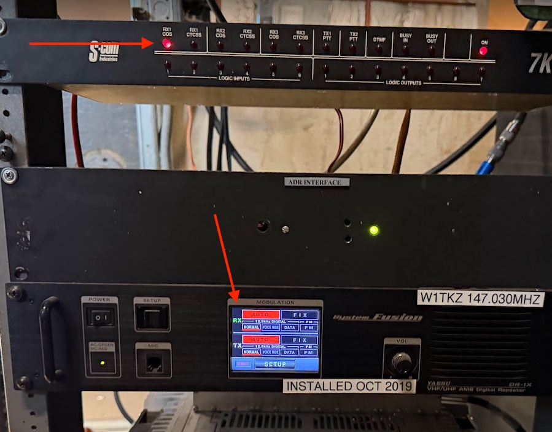

## Testing Notes from 22-Nov-2025

During a visit to install the SDRC we did some more testing.

* The squelch on the VHF repeater receiver was nearly always
open. The green "RX" indication was showing on the front of
the Yaesu box with only a few brief interruptions. And likewise,
the COS LED on the controller was almost always on. This is
likely a result of local interference. 

Here is a photo of the steady-state:

Looking at the DB25 connector that plugs into the repeater
controller:

* The **Radio 0 COS** pin (pin #2) appeared to be an open collector which was pulled to ground when the VHF receiver was active.
* The **Radio 0 CTCSS** pin (pin #5) appeared to be an open collector which was pulled to ground when the PL tone was being detected.
